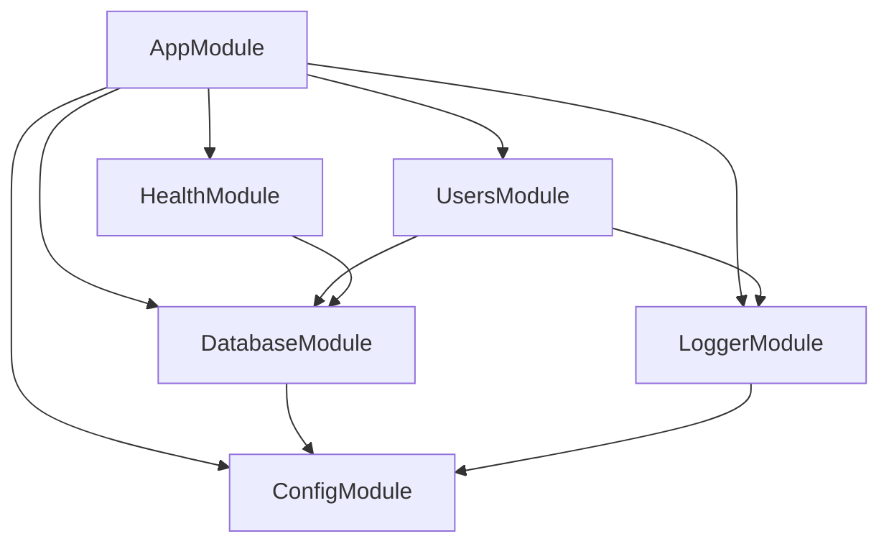

# Project Structure Guide

This guide explains the organization and architecture of the NestJS API Starter
Kit, detailing each directory, file, and their purposes within the overall
application structure.

## Table of Contents

- [Overview](#overview)
- [Root Directory Structure](#root-directory-structure)
- [Source Code Structure](#source-code-structure)
- [Configuration Files](#configuration-files)
- [Development Files](#development-files)
- [Docker Files](#docker-files)
- [Documentation Structure](#documentation-structure)
- [Module Architecture](#module-architecture)
- [File Naming Conventions](#file-naming-conventions)
- [Import Structure](#import-structure)
- [Best Practices](#best-practices)

## Overview

The NestJS API Starter Kit follows a domain-driven design with clear separation
of concerns. The architecture promotes scalability, maintainability, and
testability through well-organized modules and consistent file structure.

### Architecture Principles

- **Domain-First**: Code organized by business domains, not technical layers
- **Separation of Concerns**: Each file has a single responsibility
- **Scalability**: Structure supports growth without major refactoring
- **Consistency**: Predictable patterns across all modules
- **Testability**: Easy to locate and write tests for any component

## Root Directory Structure

```
nestjs-api-starter-kit/
├── src/                        # Source code
├── test/                       # Test files and utilities
├── docs/                       # Documentation
├── scripts/                    # Utility scripts
├── coverage/                   # Test coverage reports
├── dist/                       # Compiled JavaScript (build output)
├── logs/                       # Application logs
├── node_modules/               # Dependencies
├── .vscode/                    # VS Code configuration
├── .husky/                     # Git hooks
├── docker-compose.yml          # Docker development setup
├── docker-compose.test.yml     # Docker test environment
├── docker-compose.production.yml # Docker production setup
├── Dockerfile                  # Multi-stage Docker build
├── package.json               # Project dependencies and scripts
├── package-lock.json          # Lock file for dependencies
├── tsconfig.json              # TypeScript configuration
├── tsconfig.build.json        # TypeScript build configuration
├── nest-cli.json              # NestJS CLI configuration
├── jest.config.js             # Jest test configuration
├── eslint.config.js           # ESLint configuration
├── .prettierrc                # Prettier configuration
├── .prettierignore            # Prettier ignore rules
├── commitlint.config.js       # Commit message linting
├── renovate.json              # Dependency update automation
├── .env.example               # Environment variable template
├── .gitignore                 # Git ignore rules
├── .dockerignore              # Docker ignore rules
├── README.md                  # Project overview
└── LICENSE                    # License file
```

### Directory Purposes

| Directory       | Purpose                       | Included in Git |
| --------------- | ----------------------------- | --------------- |
| `src/`          | Application source code       | ✅              |
| `test/`         | Test files and test utilities | ✅              |
| `docs/`         | Documentation files           | ✅              |
| `scripts/`      | Build and utility scripts     | ✅              |
| `coverage/`     | Test coverage reports         | ❌              |
| `dist/`         | Compiled JavaScript output    | ❌              |
| `logs/`         | Application log files         | ❌              |
| `node_modules/` | NPM dependencies              | ❌              |
| `.vscode/`      | IDE configuration             | ✅              |
| `.husky/`       | Git hooks configuration       | ✅              |

## Source Code Structure

### Core Source Organization

```
src/
├── app.module.ts              # Root application module
├── main.ts                    # Application bootstrap/entry point
├── common/                    # Shared utilities and components
│   ├── decorators/           # Custom decorators
│   │   ├── auth.decorator.ts
│   │   └── api-response.decorator.ts
│   ├── filters/              # Exception filters
│   │   ├── global-exception.filter.ts
│   │   └── http-exception.filter.ts
│   ├── guards/               # Route guards
│   │   ├── auth.guard.ts
│   │   └── roles.guard.ts
│   ├── interceptors/         # Request/response interceptors
│   │   ├── logging.interceptor.ts
│   │   ├── transform.interceptor.ts
│   │   └── timeout.interceptor.ts
│   ├── pipes/                # Validation and transformation pipes
│   │   ├── validation.pipe.ts
│   │   └── parse-int.pipe.ts
│   ├── logger/               # Logging configuration
│   │   ├── logger.module.ts
│   │   └── winston.config.ts
│   └── interfaces/           # Shared interfaces
│       ├── api-response.interface.ts
│       └── pagination.interface.ts
├── config/                   # Configuration management
│   ├── config.module.ts      # Configuration module
│   ├── configuration.ts      # Configuration factory
│   └── validation.schema.ts  # Environment validation schema
├── database/                 # Database setup and utilities
│   ├── database.module.ts    # Database module
│   ├── data-source.ts        # TypeORM data source
│   ├── migrations/           # Database migrations
│   │   └── 1640995200000-InitialMigration.ts
│   └── seeds/                # Database seeding
│       ├── run-seeds.ts
│       └── user.seed.ts
├── health/                   # Health check module
│   ├── health.module.ts      # Health module
│   ├── health.controller.ts  # Health endpoints
│   └── health.controller.spec.ts # Health tests
└── users/                    # Example user domain module
    ├── users.module.ts       # User module
    ├── users.controller.ts   # User HTTP endpoints
    ├── users.service.ts      # User business logic
    ├── users.entity.ts       # User database entity
    ├── dto/                  # Data Transfer Objects
    │   ├── create-user.dto.ts
    │   ├── update-user.dto.ts
    │   └── user-response.dto.ts
    ├── interfaces/           # User-specific interfaces
    │   └── user.interface.ts
    └── tests/                # User module tests
        ├── users.controller.spec.ts
        ├── users.service.spec.ts
        └── users.integration.spec.ts
```

### Module Breakdown

#### Core Files

**`main.ts`** - Application Entry Point

```typescript
// Bootstrap file that:
// - Creates NestJS application instance
// - Configures global middleware, pipes, filters
// - Sets up CORS, helmet, compression
// - Starts HTTP server
```

**`app.module.ts`** - Root Module

```typescript
// Root module that:
// - Imports all feature modules
// - Configures global modules (Config, Database, etc.)
// - Sets up application-wide providers
```

#### Common Directory

The `common/` directory contains shared functionality used across multiple
modules:

**Decorators (`common/decorators/`)**

- Custom decorators for authentication, API documentation, etc.
- Reusable metadata definitions
- Parameter decorators for extracting request data

**Filters (`common/filters/`)**

- Exception handling for different error types
- Global exception filter for standardized error responses
- Custom HTTP exception filters

**Guards (`common/guards/`)**

- Authentication guards
- Authorization/role-based guards
- Custom route protection logic

**Interceptors (`common/interceptors/`)**

- Request/response transformation
- Logging interceptors
- Performance monitoring
- Response caching

**Pipes (`common/pipes/`)**

- Validation pipes with custom rules
- Transformation pipes for data conversion
- Custom parsing pipes

#### Configuration Directory

**`config/`** - Centralized Configuration

```typescript
// Configuration system that:
// - Loads environment variables
// - Validates configuration with Joi
// - Provides type-safe configuration access
// - Supports multiple environments
```

#### Database Directory

**`database/`** - Database Management

```typescript
// Database utilities including:
// - TypeORM configuration
// - Migration files
// - Database seeding
// - Connection management
```

## Test Structure

```
test/
├── setup.ts                  # Global test setup
├── setup-e2e.ts             # E2E test setup
├── jest-e2e.json            # E2E Jest configuration
├── fixtures/                 # Test data
│   ├── users.json
│   └── database-seed.sql
├── helpers/                  # Test utilities
│   ├── test-db.helper.ts
│   └── mock-factory.helper.ts
├── mocks/                    # Mock implementations
│   ├── config.mock.ts
│   └── repository.mock.ts
├── unit/                     # Additional unit tests
│   └── utils/
│       └── validation.spec.ts
└── e2e/                      # End-to-end tests
    ├── health.e2e-spec.ts
    ├── users.e2e-spec.ts
    └── app.e2e-spec.ts
```

### Test File Organization

- **Unit Tests**: Located alongside source files with `.spec.ts` extension
- **Integration Tests**: In module `tests/` directories
- **E2E Tests**: In `test/e2e/` directory with `.e2e-spec.ts` extension

## Configuration Files

### TypeScript Configuration

**`tsconfig.json`** - Main TypeScript Config

```json
{
  "compilerOptions": {
    "strict": true,
    "baseUrl": "./",
    "paths": {
      "@/*": ["src/*"],
      "@/common/*": ["src/common/*"]
    }
  }
}
```

**`tsconfig.build.json`** - Build-specific Config

```json
{
  "extends": "./tsconfig.json",
  "exclude": ["**/*.spec.ts", "**/*.test.ts"]
}
```

### Build Configuration

**`nest-cli.json`** - NestJS CLI Config

```json
{
  "collection": "@nestjs/schematics",
  "sourceRoot": "src",
  "compilerOptions": {
    "webpack": true,
    "tsConfigPath": "tsconfig.build.json"
  }
}
```

### Code Quality Configuration

**`eslint.config.js`** - ESLint Rules

- TypeScript-specific rules
- Import organization rules
- NestJS best practices
- Prettier integration

**`.prettierrc`** - Code Formatting

- Consistent code style
- Import sorting
- Line length limits

## Development Files

### Git Configuration

**`.gitignore`** - Version Control Exclusions

```
# Dependencies
node_modules/

# Build outputs
dist/
coverage/

# Environment files
.env
.env.local

# Logs
logs/
*.log

# IDE files
.DS_Store
.vscode/settings.json
```

### VS Code Configuration

**`.vscode/`** - IDE Settings

```
.vscode/
├── settings.json      # Workspace settings
├── launch.json        # Debug configuration
├── tasks.json         # Build tasks
└── extensions.json    # Recommended extensions
```

### Git Hooks

**`.husky/`** - Git Hooks

```
.husky/
├── pre-commit         # Lint staged files
├── commit-msg         # Validate commit messages
└── pre-push           # Run tests before push
```

## Docker Files

### Container Configuration

**`Dockerfile`** - Multi-stage Build

```dockerfile
# Development stage
FROM node:20-alpine AS development
# ... development configuration

# Build stage
FROM node:20-alpine AS build
# ... build process

# Production stage
FROM node:20-alpine AS production
# ... production optimization
```

**Docker Compose Files**

- `docker-compose.yml` - Development environment
- `docker-compose.test.yml` - Test environment
- `docker-compose.production.yml` - Production setup

## Documentation Structure

```
docs/
├── getting-started.md         # Setup and installation guide
├── development.md            # Development workflow
├── testing.md                # Testing strategies
├── docker.md                 # Container usage
├── tooling.md                # Development tools
├── environment-variables.md  # Configuration reference
├── project-structure.md      # This document
├── contributing.md           # Contribution guidelines
├── deployment.md             # Production deployment
└── api/                      # API documentation (future)
    ├── authentication.md
    ├── users.md
    └── health.md
```

## Module Architecture

### Standard Module Structure

Each domain module follows a consistent structure:

```
users/                        # Domain module
├── users.module.ts          # Module definition
├── users.controller.ts      # HTTP layer
├── users.service.ts         # Business logic
├── users.entity.ts          # Database entity
├── dto/                     # Data Transfer Objects
│   ├── create-user.dto.ts   # Creation payload
│   ├── update-user.dto.ts   # Update payload
│   └── user-response.dto.ts # Response format
├── interfaces/              # TypeScript interfaces
│   ├── user.interface.ts    # Domain interfaces
│   └── user-repository.interface.ts
├── guards/                  # Module-specific guards
│   └── user-ownership.guard.ts
├── decorators/              # Custom decorators
│   └── current-user.decorator.ts
└── tests/                   # Module tests
    ├── users.controller.spec.ts
    ├── users.service.spec.ts
    └── users.integration.spec.ts
```

### Module Dependencies



### Layer Architecture

```
Controller Layer    (HTTP/GraphQL/WebSocket)
    ↓
Service Layer      (Business Logic)
    ↓
Repository Layer   (Data Access)
    ↓
Entity Layer       (Data Models)
```

## File Naming Conventions

### Naming Patterns

| File Type        | Pattern                 | Example                             |
| ---------------- | ----------------------- | ----------------------------------- |
| **Modules**      | `*.module.ts`           | `users.module.ts`                   |
| **Controllers**  | `*.controller.ts`       | `users.controller.ts`               |
| **Services**     | `*.service.ts`          | `users.service.ts`                  |
| **Entities**     | `*.entity.ts`           | `user.entity.ts`                    |
| **DTOs**         | `*.dto.ts`              | `create-user.dto.ts`                |
| **Interfaces**   | `*.interface.ts`        | `user.interface.ts`                 |
| **Types**        | `*.type.ts`             | `user-status.type.ts`               |
| **Guards**       | `*.guard.ts`            | `auth.guard.ts`                     |
| **Decorators**   | `*.decorator.ts`        | `roles.decorator.ts`                |
| **Filters**      | `*.filter.ts`           | `http-exception.filter.ts`          |
| **Interceptors** | `*.interceptor.ts`      | `logging.interceptor.ts`            |
| **Pipes**        | `*.pipe.ts`             | `validation.pipe.ts`                |
| **Middlewares**  | `*.middleware.ts`       | `logger.middleware.ts`              |
| **Unit Tests**   | `*.spec.ts`             | `users.service.spec.ts`             |
| **E2E Tests**    | `*.e2e-spec.ts`         | `users.e2e-spec.ts`                 |
| **Migrations**   | `{timestamp}-{Name}.ts` | `1640995200000-CreateUsersTable.ts` |

### Directory Naming

- Use **kebab-case** for directories: `user-management/`
- Use **plural** for domain modules: `users/`, `orders/`
- Use **singular** for utility directories: `config/`, `common/`

## Import Structure

### Import Organization

Imports should be organized in the following order:

```typescript
// 1. Node.js built-in modules
import { readFileSync } from 'fs';
import { join } from 'path';

// 2. External libraries
import { Injectable, Logger, NotFoundException } from '@nestjs/common';
import { InjectRepository } from '@nestjs/typeorm';
import { Repository } from 'typeorm';

// 3. Internal modules (absolute imports)
import { ConfigService } from '@/config/config.service';
import { DatabaseService } from '@/database/database.service';
import { User } from '@/users/entities/user.entity';

// 4. Relative imports (same module)
import { CreateUserDto } from './dto/create-user.dto';
import { UpdateUserDto } from './dto/update-user.dto';
import { UserInterface } from './interfaces/user.interface';
```

### Path Mapping

TypeScript path mapping is configured for clean imports:

```typescript
// Instead of relative imports
import { User } from '../../../users/entities/user.entity';

// Use absolute imports
import { User } from '@/users/entities/user.entity';
```

**Path Mapping Configuration:**

```json
{
  "paths": {
    "@/*": ["src/*"],
    "@/common/*": ["src/common/*"],
    "@/config/*": ["src/config/*"],
    "@/database/*": ["src/database/*"],
    "@/users/*": ["src/users/*"]
  }
}
```

## Best Practices

### Module Organization

1. **Domain-First Structure**
   - Organize by business domains, not technical layers
   - Keep related functionality together
   - Minimize cross-module dependencies

2. **Consistent Module Structure**
   - Follow the standard module template
   - Use predictable file naming
   - Maintain consistent directory structure

3. **Clear Separation of Concerns**
   - Controllers handle HTTP concerns only
   - Services contain business logic
   - Entities define data models
   - DTOs handle data validation

### File Organization

1. **Single Responsibility**
   - One class per file
   - Clear file naming
   - Focused functionality

2. **Logical Grouping**
   - Group related files in directories
   - Use subdirectories for complex modules
   - Keep test files close to source

3. **Import Management**
   - Use absolute imports for cross-module references
   - Organize imports consistently
   - Avoid circular dependencies

### Scalability Considerations

1. **Modular Architecture**
   - Design for feature modules
   - Use shared modules for common functionality
   - Plan for microservice extraction

2. **Configuration Management**
   - Centralized configuration
   - Environment-specific settings
   - Validation and type safety

3. **Testing Structure**
   - Co-locate unit tests with source
   - Separate integration and E2E tests
   - Use consistent test patterns

### Code Organization Guidelines

1. **Naming Consistency**
   - Follow established patterns
   - Use descriptive names
   - Avoid abbreviations

2. **Directory Structure**
   - Logical hierarchy
   - Consistent patterns
   - Easy navigation

3. **Documentation**
   - README files for complex modules
   - Inline documentation for public APIs
   - Architecture decision records

---

This project structure provides a solid foundation for building scalable NestJS
applications. The organization promotes code reusability, maintainability, and
team collaboration while supporting growth from small projects to large
enterprise applications.

**Next:** Learn about [Contributing Guidelines](contributing.md) to understand
how to contribute to the project.
