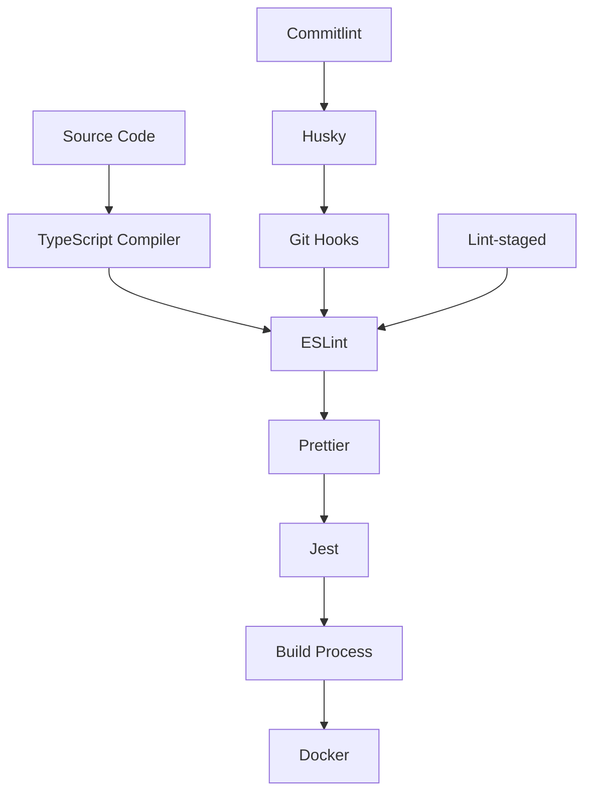

# Development Tooling Guide

This guide covers all the development tools integrated into the NestJS API
Starter Kit, their configurations, and how they work together to maintain code
quality and developer productivity.

## Table of Contents

- [Tooling Overview](#tooling-overview)
- [Code Quality Tools](#code-quality-tools)
- [TypeScript Configuration](#typescript-configuration)
- [Testing Tools](#testing-tools)
- [Build Tools](#build-tools)
- [Git Hooks & Automation](#git-hooks--automation)
- [Package Management](#package-management)
- [IDE Integration](#ide-integration)
- [Debugging Tools](#debugging-tools)
- [Monitoring & Logging](#monitoring--logging)
- [Security Tools](#security-tools)
- [Performance Tools](#performance-tools)
- [Customization](#customization)

## Tooling Overview

The NestJS API Starter Kit includes a comprehensive set of development tools
designed to work together seamlessly:

### Core Development Stack



### Tool Categories

| Category               | Tools                            | Purpose                            |
| ---------------------- | -------------------------------- | ---------------------------------- |
| **Code Quality**       | ESLint, Prettier, TypeScript     | Linting, formatting, type checking |
| **Testing**            | Jest, Supertest                  | Unit, integration, E2E testing     |
| **Build**              | NestJS CLI, Webpack, TypeScript  | Application compilation            |
| **Git Hooks**          | Husky, lint-staged, commitlint   | Pre-commit validation              |
| **Package Management** | npm, Renovate                    | Dependency management              |
| **Development**        | Nodemon, ts-node                 | Hot reloading, development server  |
| **Security**           | npm audit, ESLint security rules | Vulnerability scanning             |

## Code Quality Tools

### ESLint Configuration

ESLint provides static code analysis and enforces coding standards.

**Configuration (`eslint.config.js`):**

```javascript
module.exports = [
  {
    files: ['**/*.ts', '**/*.tsx'],
    languageOptions: {
      parser: tsParser,
      parserOptions: {
        project: './tsconfig.json',
        sourceType: 'module',
      },
    },
    plugins: {
      '@typescript-eslint': tsPlugin,
      prettier: prettierPlugin,
      import: importPlugin,
    },
    rules: {
      // TypeScript Rules
      '@typescript-eslint/no-explicit-any': 'warn',
      '@typescript-eslint/no-unused-vars': [
        'error',
        { argsIgnorePattern: '^_' },
      ],
      '@typescript-eslint/prefer-const': 'error',

      // Import Rules
      'import/order': [
        'error',
        {
          groups: [
            'builtin',
            'external',
            'internal',
            'parent',
            'sibling',
            'index',
          ],
          'newlines-between': 'always',
          alphabetize: { order: 'asc', caseInsensitive: true },
        },
      ],

      // General Rules
      'no-console': 'warn',
      'prefer-const': 'error',
      'prettier/prettier': 'error',
    },
  },
];
```

**Key Features:**

- **TypeScript Integration**: Full TypeScript support with type-aware linting
- **Import Organization**: Automatic import sorting and grouping
- **Prettier Integration**: Ensures formatting consistency
- **Custom Rules**: Tailored for NestJS development patterns

**Usage Commands:**

```bash
# Lint all files
npm run lint

# Lint and fix automatically fixable issues
npm run lint

# Check linting without fixing
npm run lint:check

# Lint specific files
npx eslint src/users/users.service.ts

# Show rule documentation
npx eslint --print-config src/main.ts
```

### Prettier Configuration

Prettier handles code formatting automatically.

**Configuration (`.prettierrc`):**

```json
{
  "semi": true,
  "trailingComma": "all",
  "singleQuote": true,
  "printWidth": 100,
  "tabWidth": 2,
  "useTabs": false,
  "endOfLine": "lf",
  "arrowParens": "avoid",
  "bracketSpacing": true,
  "bracketSameLine": false,
  "quoteProps": "as-needed"
}
```

**Prettier Ignore (`.prettierignore`):**

```
dist/
coverage/
node_modules/
*.min.js
*.min.css
CHANGELOG.md
```

**Usage Commands:**

```bash
# Format all files
npm run format

# Check formatting without fixing
npm run format:check

# Format specific files
npx prettier --write src/users/users.service.ts

# Check if files are formatted correctly
npx prettier --check src/
```

### Integration with IDE

**VS Code Settings (`.vscode/settings.json`):**

```json
{
  "editor.formatOnSave": true,
  "editor.defaultFormatter": "esbenp.prettier-vscode",
  "editor.codeActionsOnSave": {
    "source.fixAll.eslint": true,
    "source.organizeImports": true
  },
  "eslint.validate": ["typescript", "javascript"],
  "typescript.preferences.importModuleSpecifier": "relative"
}
```

## TypeScript Configuration

### Main Configuration (`tsconfig.json`)

```json
{
  "compilerOptions": {
    "module": "commonjs",
    "declaration": true,
    "removeComments": true,
    "emitDecoratorMetadata": true,
    "experimentalDecorators": true,
    "allowSyntheticDefaultImports": true,
    "target": "ES2021",
    "sourceMap": true,
    "outDir": "./dist",
    "baseUrl": "./",
    "incremental": true,
    "skipLibCheck": true,
    "strict": true,
    "noImplicitAny": true,
    "strictNullChecks": true,
    "strictFunctionTypes": true,
    "noImplicitReturns": true,
    "noImplicitThis": true,
    "noUnusedLocals": true,
    "noUnusedParameters": true,
    "exactOptionalPropertyTypes": true,
    "paths": {
      "@/*": ["src/*"],
      "@/common/*": ["src/common/*"],
      "@/config/*": ["src/config/*"],
      "@/database/*": ["src/database/*"]
    }
  },
  "include": ["src/**/*"],
  "exclude": [
    "node_modules",
    "dist",
    "coverage",
    "**/*.spec.ts",
    "**/*.test.ts"
  ]
}
```

### Build Configuration (`tsconfig.build.json`)

```json
{
  "extends": "./tsconfig.json",
  "exclude": [
    "node_modules",
    "dist",
    "coverage",
    "**/*.spec.ts",
    "**/*.test.ts",
    "**/*.e2e-spec.ts"
  ]
}
```

### Key Features

- **Strict Mode**: Enabled for maximum type safety
- **Path Mapping**: Clean imports with `@/` aliases
- **Decorator Support**: Full support for NestJS decorators
- **Incremental Compilation**: Faster builds with caching
- **Source Maps**: Debug support with source mapping

### TypeScript Commands

```bash
# Type checking only (no compilation)
npx tsc --noEmit

# Build with type checking
npm run build

# Watch mode for development
npx tsc --watch

# Check specific file
npx tsc --noEmit src/users/users.service.ts
```

## Testing Tools

### Jest Configuration

Jest is configured for comprehensive testing with TypeScript support.

**Main Configuration (`jest.config.js`):**

```javascript
module.exports = {
  displayName: 'Unit Tests',
  moduleFileExtensions: ['js', 'json', 'ts'],
  rootDir: '.',
  testRegex: '.*\\.spec\\.ts$',
  transform: {
    '^.+\\.(t|j)s$': 'ts-jest',
  },
  collectCoverageFrom: [
    'src/**/*.{ts,js}',
    '!src/**/*.d.ts',
    '!src/**/*.interface.ts',
    '!src/**/*.module.ts',
    '!src/**/*.entity.ts',
    '!src/main.ts',
  ],
  coverageDirectory: 'coverage',
  coverageReporters: ['text', 'lcov', 'html', 'json'],
  coverageThreshold: {
    global: {
      branches: 80,
      functions: 80,
      lines: 80,
      statements: 80,
    },
  },
  testEnvironment: 'node',
  setupFilesAfterEnv: ['<rootDir>/test/setup.ts'],
  moduleNameMapping: {
    '^@/(.*)$': '<rootDir>/src/$1',
  },
};
```

### E2E Test Configuration (`test/jest-e2e.json`)

```json
{
  "moduleFileExtensions": ["js", "json", "ts"],
  "rootDir": ".",
  "testEnvironment": "node",
  "testRegex": ".e2e-spec.ts$",
  "transform": {
    "^.+\\.(t|j)s$": "ts-jest"
  },
  "collectCoverageFrom": [
    "src/**/*.{ts,js}",
    "!src/**/*.interface.ts",
    "!src/**/*.module.ts"
  ],
  "coverageDirectory": "coverage-e2e",
  "setupFilesAfterEnv": ["<rootDir>/test/setup-e2e.ts"]
}
```

### Testing Commands

```bash
# Run all unit tests
npm test

# Run tests in watch mode
npm run test:watch

# Run tests with coverage
npm run test:cov

# Run E2E tests
npm run test:e2e

# Run all tests
npm run test:all

# Debug tests
npm run test:debug

# Run specific test file
npm test -- users.service.spec.ts

# Run tests matching pattern
npm test -- --testNamePattern="should create user"
```

## Build Tools

### NestJS CLI Configuration

**Configuration (`nest-cli.json`):**

```json
{
  "$schema": "https://json.schemastore.org/nest-cli",
  "collection": "@nestjs/schematics",
  "sourceRoot": "src",
  "compilerOptions": {
    "deleteOutDir": true,
    "webpack": true,
    "tsConfigPath": "tsconfig.build.json"
  },
  "projects": {
    "nestjs-api-starter-kit": {
      "type": "application",
      "root": "",
      "entryFile": "main",
      "sourceRoot": "src",
      "compilerOptions": {
        "tsConfigPath": "tsconfig.build.json"
      }
    }
  }
}
```

### Build Commands

```bash
# Development build with watch
npm run start:dev

# Production build
npm run build

# Clean build (remove dist folder first)
rm -rf dist && npm run build

# Build with webpack info
nest build --webpack

# Generate NestJS components
nest g module users
nest g controller users
nest g service users
nest g resource users
```

### Webpack Configuration (Hot Module Replacement)

```javascript
// webpack-hmr.config.js
const { RunScriptWebpackPlugin } = require('run-script-webpack-plugin');

module.exports = function (options, webpack) {
  return {
    ...options,
    entry: ['webpack/hot/poll?100', options.entry],
    externals: {
      ...options.externals,
    },
    plugins: [
      ...options.plugins,
      new webpack.HotModuleReplacementPlugin(),
      new webpack.WatchIgnorePlugin({
        paths: [/\.js$/, /\.d\.ts$/],
      }),
      new RunScriptWebpackPlugin({
        name: options.output.filename,
        autoRestart: false,
      }),
    ],
  };
};
```

## Git Hooks & Automation

### Husky Configuration

Husky manages Git hooks for quality assurance.

**Installation:**

```bash
# Install husky
npm install --save-dev husky

# Initialize husky
npx husky install

# Add to package.json
npm pkg set scripts.prepare="husky install"
```

**Hook Configuration (`.husky/pre-commit`):**

```bash
#!/usr/bin/env sh
. "$(dirname -- "$0")/_/husky.sh"

npx lint-staged
```

**Hook Configuration (`.husky/commit-msg`):**

```bash
#!/usr/bin/env sh
. "$(dirname -- "$0")/_/husky.sh"

npx --no -- commitlint --edit ${1}
```

### Lint-staged Configuration

Runs tools on staged files only for faster pre-commit hooks.

**Configuration (`package.json`):**

```json
{
  "lint-staged": {
    "*.{ts,js}": ["eslint --fix", "prettier --write"],
    "*.{json,md,yml,yaml}": ["prettier --write"]
  }
}
```

### Commitlint Configuration

Enforces conventional commit messages.

**Configuration (`commitlint.config.js`):**

```javascript
module.exports = {
  extends: ['@commitlint/config-conventional'],
  rules: {
    'type-enum': [
      2,
      'always',
      [
        'feat', // New feature
        'fix', // Bug fix
        'docs', // Documentation changes
        'style', // Code style changes
        'refactor', // Code refactoring
        'test', // Adding or updating tests
        'chore', // Maintenance tasks
        'perf', // Performance improvements
        'ci', // CI/CD changes
        'build', // Build system changes
        'revert', // Revert previous commit
      ],
    ],
    'subject-max-length': [2, 'always', 100],
    'body-max-line-length': [2, 'always', 100],
  },
};
```

**Valid Commit Examples:**

```bash
feat(auth): implement JWT authentication
fix(users): resolve email validation issue
docs(api): update endpoint documentation
test(users): add unit tests for user service
chore(deps): update dependencies
```

## Package Management

### npm Configuration

**Package.json Scripts Organization:**

```json
{
  "scripts": {
    "setup": "chmod +x scripts/setup.sh && ./scripts/setup.sh",

    "build": "nest build",

    "start": "nest start",
    "start:dev": "nest start --watch",
    "start:debug": "nest start --debug --watch",
    "start:prod": "node dist/main",

    "test": "jest",
    "test:watch": "jest --watch",
    "test:cov": "jest --coverage",
    "test:e2e": "jest --config ./test/jest-e2e.json",
    "test:all": "npm run test && npm run test:e2e",

    "lint": "eslint \"{src,apps,libs,test}/**/*.ts\" --fix",
    "lint:check": "eslint \"{src,apps,libs,test}/**/*.ts\"",

    "format": "prettier --write \"src/**/*.ts\" \"test/**/*.ts\"",
    "format:check": "prettier --check \"src/**/*.ts\" \"test/**/*.ts\"",

    "typeorm": "typeorm-ts-node-commonjs",
    "typeorm:migration:generate": "npm run typeorm -- migration:generate src/database/migrations/Migration -d src/database/data-source.ts",
    "typeorm:migration:run": "npm run typeorm -- migration:run -d src/database/data-source.ts"
  }
}
```

### Renovate Configuration

Automated dependency updates with Renovate.

**Configuration (`renovate.json`):**

```json
{
  "$schema": "https://docs.renovatebot.com/renovate-schema.json",
  "extends": ["config:base"],
  "schedule": ["before 4am on Monday"],
  "timezone": "UTC",
  "packageRules": [
    {
      "matchPackagePatterns": ["^@nestjs/"],
      "groupName": "NestJS packages",
      "schedule": ["before 4am on Monday"]
    },
    {
      "matchPackagePatterns": ["^@types/"],
      "groupName": "TypeScript type definitions",
      "schedule": ["before 4am on Monday"]
    },
    {
      "matchDepTypes": ["devDependencies"],
      "groupName": "Development dependencies",
      "schedule": ["before 4am on Monday"]
    }
  ],
  "vulnerabilityAlerts": {
    "schedule": ["at any time"]
  },
  "lockFileMaintenance": {
    "enabled": true,
    "schedule": ["before 4am on Monday"]
  }
}
```

## IDE Integration

### VS Code Extensions

**Recommended Extensions (`.vscode/extensions.json`):**

```json
{
  "recommendations": [
    "esbenp.prettier-vscode",
    "dbaeumer.vscode-eslint",
    "ms-vscode.vscode-typescript-next",
    "bradlc.vscode-tailwindcss",
    "ms-vscode-remote.remote-containers",
    "ms-azuretools.vscode-docker",
    "ckolkman.vscode-postgres",
    "humao.rest-client",
    "ms-vscode.test-adapter-converter"
  ]
}
```

### VS Code Settings

**Workspace Settings (`.vscode/settings.json`):**

```json
{
  "editor.formatOnSave": true,
  "editor.defaultFormatter": "esbenp.prettier-vscode",
  "editor.codeActionsOnSave": {
    "source.fixAll.eslint": true,
    "source.organizeImports": true
  },
  "eslint.validate": ["typescript"],
  "typescript.preferences.importModuleSpecifier": "relative",
  "files.exclude": {
    "**/node_modules": true,
    "**/dist": true,
    "**/.git": true,
    "**/coverage": true
  },
  "search.exclude": {
    "**/node_modules": true,
    "**/dist": true,
    "**/coverage": true
  },
  "typescript.suggest.autoImports": true,
  "typescript.suggest.includeCompletionsWithSnippetText": true
}
```

### Debug Configuration

**Debug Settings (`.vscode/launch.json`):**

```json
{
  "version": "0.2.0",
  "configurations": [
    {
      "name": "Launch NestJS",
      "type": "node",
      "request": "launch",
      "program": "${workspaceFolder}/src/main.ts",
      "runtimeArgs": [
        "-r",
        "ts-node/register",
        "-r",
        "tsconfig-paths/register"
      ],
      "sourceMaps": true,
      "envFile": "${workspaceFolder}/.env",
      "cwd": "${workspaceFolder}",
      "console": "integratedTerminal"
    },
    {
      "name": "Debug Jest Tests",
      "type": "node",
      "request": "launch",
      "program": "${workspaceFolder}/node_modules/.bin/jest",
      "args": ["--runInBand"],
      "cwd": "${workspaceFolder}",
      "console": "integratedTerminal",
      "internalConsoleOptions": "neverOpen"
    }
  ]
}
```

## Debugging Tools

### Node.js Inspector

```bash
# Start with debugging enabled
npm run start:debug

# Or manually
node --inspect-brk=0.0.0.0:9229 dist/main.js
```

### Debug Configuration

**Debug Environment Variables:**

```env
# Enable debug logging
LOG_LEVEL=debug
DEBUG=*

# TypeORM query logging
DB_LOGGING=true
DB_SYNCHRONIZE=false
```

### Chrome DevTools

1. Start debug mode: `npm run start:debug`
2. Open Chrome and navigate to: `chrome://inspect`
3. Click "Open dedicated DevTools for Node"

## Monitoring & Logging

### Winston Logger Configuration

**Configuration (`src/common/logger/winston.config.ts`):**

```typescript
import { format, transports } from 'winston';

export const winstonConfig = {
  level: process.env.LOG_LEVEL || 'info',
  format: format.combine(
    format.timestamp(),
    format.errors({ stack: true }),
    format.json(),
  ),
  transports: [
    new transports.Console({
      format: format.combine(format.colorize(), format.simple()),
    }),
    new transports.File({
      filename: 'logs/error.log',
      level: 'error',
    }),
    new transports.File({
      filename: 'logs/combined.log',
    }),
  ],
};
```

### Health Check Tools

Health endpoints for monitoring:

- `/health/live` - Liveness probe
- `/health/ready` - Readiness probe
- `/health` - Detailed health information

## Security Tools

### npm audit

```bash
# Check for vulnerabilities
npm audit

# Fix automatically fixable vulnerabilities
npm audit fix

# Force fix (be careful with this)
npm audit fix --force

# Generate audit report
npm audit --json > audit-report.json
```

### ESLint Security Rules

Security-focused ESLint rules are included:

```javascript
// Example security rules
rules: {
  'no-eval': 'error',
  'no-implied-eval': 'error',
  'no-new-func': 'error',
  'no-script-url': 'error',
}
```

### Environment Variable Validation

Using Joi for environment validation:

```typescript
// src/config/validation.schema.ts
export const validationSchema = Joi.object({
  NODE_ENV: Joi.string().valid('development', 'production', 'test'),
  JWT_SECRET: Joi.string().min(32).required(),
  DB_PASSWORD: Joi.string().required(),
});
```

## Performance Tools

### Build Performance

```bash
# Analyze bundle size
npm run build -- --analyze

# Build timing information
npm run build -- --profile
```

### Runtime Performance

```typescript
// Performance monitoring interceptor
@Injectable()
export class PerformanceInterceptor implements NestInterceptor {
  intercept(context: ExecutionContext, next: CallHandler): Observable<any> {
    const start = Date.now();
    return next.handle().pipe(
      tap(() => {
        const duration = Date.now() - start;
        console.log(`Request took ${duration}ms`);
      }),
    );
  }
}
```

### Memory Monitoring

```bash
# Monitor memory usage
node --inspect --expose-gc dist/main.js

# Heap snapshots for memory analysis
node --inspect --heap-prof dist/main.js
```

## Customization

### Adding New Tools

1. **Install the tool**

   ```bash
   npm install --save-dev new-tool
   ```

2. **Configure the tool** Create configuration file (e.g., `.newtoolrc`)

3. **Integrate with scripts**

   ```json
   {
     "scripts": {
       "new-tool": "new-tool src/",
       "new-tool:fix": "new-tool --fix src/"
     }
   }
   ```

4. **Add to git hooks**
   ```json
   {
     "lint-staged": {
       "*.ts": ["new-tool --fix"]
     }
   }
   ```

### Custom ESLint Rules

```javascript
// custom-rules/no-console-log.js
module.exports = {
  meta: {
    type: 'problem',
    docs: {
      description: 'Disallow console.log in production',
    },
  },
  create(context) {
    return {
      CallExpression(node) {
        if (
          node.callee.object?.name === 'console' &&
          node.callee.property?.name === 'log'
        ) {
          context.report(node, 'console.log is not allowed');
        }
      },
    };
  },
};
```

### Custom Jest Matchers

```typescript
// test/custom-matchers.ts
expect.extend({
  toBeValidUser(received) {
    const pass = received.id && received.email && received.name;
    return {
      pass,
      message: () =>
        pass ? 'Expected not to be valid user' : 'Expected to be valid user',
    };
  },
});
```

### Tool Integration Checklist

When adding new tools:

- [ ] Install and configure the tool
- [ ] Add npm scripts
- [ ] Integrate with git hooks (if applicable)
- [ ] Update IDE configuration
- [ ] Add to CI/CD pipeline
- [ ] Update documentation
- [ ] Test the integration

---

This comprehensive tooling guide ensures you understand all the development
tools integrated into the NestJS API Starter Kit. These tools work together to
maintain high code quality, consistent formatting, and reliable development
workflows.

**Next:** Learn about [Environment Variables](environment-variables.md) to
understand configuration management.
